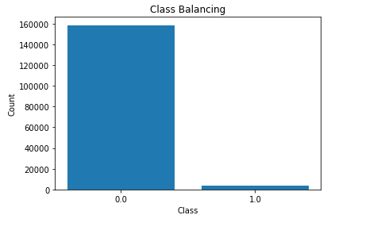
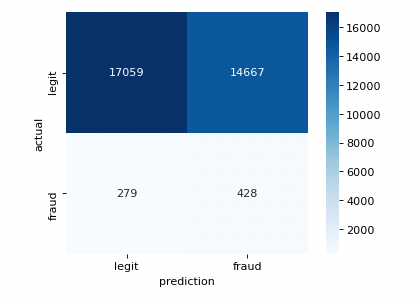

						##Prediction Credit Card fraud

The goal of the project is to improve the efficacy of fraudulent transaction alerts for millions of people and help businesses reduce their fraud loss and increase their revenue.

The dataset is provided by Vesta corporation which I obtained from Kaggle using this [link](https://www.kaggle.com/c/ieee-fraud-detection/)

Looking at the class distribution, we can see there is a huge imbalance in class. We have to fix the imbalance before modeling.

Let's try oversampling the minority class and then fit a logistic regression model.

Positive class predictions seem to look better after this:

